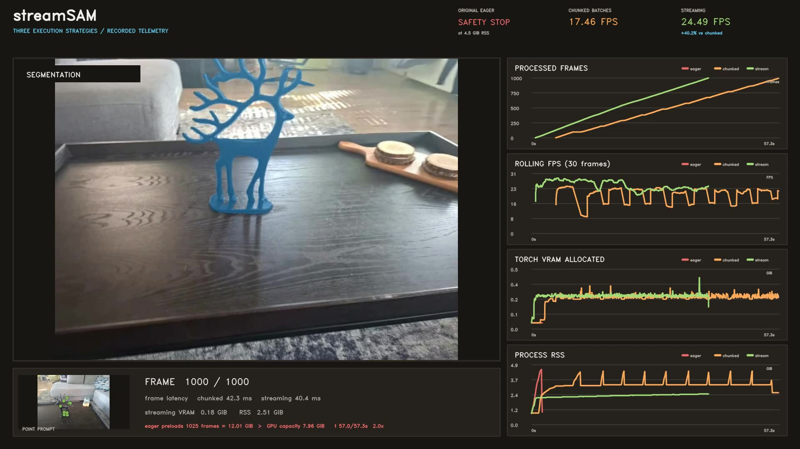

# streamSAM

Bounded, observable streaming video segmentation built on SAM 2 and EdgeTAM.

[](docs/assets/streamsam-benchmark.mp4)

<p align="center">
  <strong><a href="docs/assets/streamsam-benchmark.mp4">Watch the 32-second benchmark replay</a></strong><br>
  One point prompt, 1,000 frames, synchronized segmentation and recorded telemetry.
</p>

| Execution strategy | Result | End-to-end FPS | Peak process RSS |
| --- | ---: | ---: | ---: |
| Original eager loading | Safety stop before frame 1 | n/a | 4.5 GiB limit |
| Independent 96-frame batches | 1,000 / 1,000 frames | 17.46 | 4.40 GiB |
| streamSAM | 1,000 / 1,000 frames | **24.49** | **2.52 GiB** |

This is one matched local run on an NVIDIA GeForce RTX 5060 Laptop GPU using
BF16 without compilation. The source, checkpoint, prompt and shared settings are
the same across all three strategies. streamSAM was 40.2% faster than independent
chunking and used 42.6% less peak process RSS in this run.

The source contains 1,025 frames and the requested workload is 1,000. The
original eager initializer tries to materialize the complete 12.01 GiB
normalized input tensor before the frame limit can apply, exceeding the 7.96
GiB GPU capacity. The runner stopped it at the configured host RSS limit rather
than destabilizing the machine. This is a recorded safety stop, not a claimed
CUDA OOM. The two successful 1,000-frame runs reuse their original telemetry;
the chart renderer runs afterward and does not affect the measurements. No
benchmark process runs through Gradio.

`streamSAM` is a systems fork of EdgeTAM for long-running, frame-ordered video
workloads. It keeps the existing `sam2` Python API, EdgeTAM checkpoints and model
configs, then adds the execution layer needed to stream without retaining a
video-sized working set.

## What streamSAM adds

- Lazy frame sources with bounded decode queues and explicit backpressure.
- A fixed two-slot pinned-memory and GPU staging ring with CUDA event ownership.
- Optional one-frame-ahead image feature production on a separate CUDA stream.
- A predict-then-commit API that lets downstream systems adjust a mask before it
  enters temporal memory.
- Bounded asynchronous video output, GPU stage timing, NVTX ranges and Perfetto
  traces.
- Contract checks and matched benchmark tooling for throughput, memory and mask
  fidelity.

The temporal model still advances in order. Decode, transfer, optional image
encoding and output work can overlap around it, while queues, frame slots,
features and memory state stay bounded.

The import namespace remains `sam2`. Existing calls such as
`from sam2.build_sam import build_sam2_video_predictor` keep working. The
`edgetam.yaml` config and `edgetam.pt` checkpoint names also remain unchanged
because they identify the upstream model, not this repository's streaming layer.

## Lineage and thanks

streamSAM exists because Meta published [SAM 2](https://github.com/facebookresearch/sam2)
and [EdgeTAM](https://github.com/facebookresearch/EdgeTAM). Thank you to both
teams for the predictor API, model architecture, checkpoints and research this
work extends. streamSAM is an independent fork and is not affiliated with or
endorsed by Meta.

The EdgeTAM paper, authors and original results are retained below. Cite the
upstream work when you use its model or checkpoints.

## EdgeTAM upstream

[Chong Zhou<sup>1,2*</sup>](https://chongzhou96.github.io/),
[Chenchen Zhu<sup>1</sup>](https://sites.google.com/andrew.cmu.edu/zcckernel/home),
[Yunyang Xiong<sup>1</sup>](https://pages.cs.wisc.edu/~yunyang/),
[Saksham Suri<sup>1</sup>](https://www.cs.umd.edu/~sakshams/),
[Fanyi Xiao<sup>1</sup>](https://fanyix.cs.ucdavis.edu/),
[Lemeng Wu<sup>1</sup>](https://sites.google.com/view/lemeng-wu/home),
[Raghuraman Krishnamoorthi<sup>1</sup>](https://scholar.google.com/citations?user=F1mr9C0AAAAJ&hl=en),
[Bo Dai<sup>3,4</sup>](https://daibo.info/),
[Chen Change Loy<sup>2</sup>](https://www.mmlab-ntu.com/person/ccloy/),
[Vikas Chandra<sup>1</sup>](https://v-chandra.github.io/),
[Bilge Soran<sup>1</sup>](https://scholar.google.com/citations?user=9nXD6pwAAAAJ&hl=en)

<sup>1</sup>Meta Reality Labs,
<sup>2</sup>S-Lab, Nanyang Technological University,
<sup>3</sup>University of Hong Kong,
<sup>4</sup>Feeling AI

(*) Work done during the internship at Meta Reality Labs.

[[`Paper`](https://arxiv.org/abs/2501.07256)] [[`Demo`](https://huggingface.co/spaces/facebook/EdgeTAM)] [[`BibTeX`](#citing-edgetam)]


### Overview

**EdgeTAM** is an on-device executable variant of the SAM 2 for promptable segmentation and tracking in videos.
It runs **22× faster** than SAM 2 and achieves **16 FPS** on iPhone 15 Pro Max without quantization.

<p align="center">
  
</p>

*In this figure, we show the speed-performance trade-offs of EdgeTAM and other models on iPhone 15 Pro Max (red) and NVIDIA A100 (blue). We report the J&F on the SA-V val dataset as the evaluation metric.*

## Installation

streamSAM requires `python>=3.10`, `torch>=2.3.1` and
`torchvision>=0.18.1`. Install PyTorch and TorchVision for your platform first,
then install this repository on a GPU machine:

```bash
git clone https://github.com/dej-h/streamSAM.git && cd streamSAM

pip install -e .
```

To run the predictor notebooks, install the notebook dependencies:

```bash
pip install -e ".[notebooks]"
```

For the upstream EdgeTAM CoreML export path, install the CoreML dependencies:

```bash
pip install -e ".[coreml]"
```

Note:
1. It's recommended to create a new Python environment via [Anaconda](https://www.anaconda.com/) for this installation and install PyTorch 2.3.1 (or higher) via `pip` following https://pytorch.org/. If you have a PyTorch version lower than 2.3.1 in your current environment, the installation command above will try to upgrade it to the latest PyTorch version using `pip`.
2. The step above requires compiling a custom CUDA kernel with the `nvcc` compiler. If it isn't already available on your machine, please install the [CUDA toolkits](https://developer.nvidia.com/cuda-toolkit-archive) with a version that matches your PyTorch CUDA version.
3. If you see a message like `Failed to build the SAM 2 CUDA extension` during installation, you can ignore it and still use EdgeTAM (some post-processing functionality may be limited, but it doesn't affect the results in most cases).


## Getting Started

### Downloading the model

Model is available [here](https://github.com/facebookresearch/EdgeTAM/tree/main/checkpoints/edgetam.pt).

### streamSAM Gradio demo

The local demo exercises streamSAM's bounded video path with the EdgeTAM model.
The [upstream EdgeTAM Hugging Face Space](https://huggingface.co/spaces/facebook/EdgeTAM)
is available for a quick model-only demo.

Install the dependencies for the Gradio demo:

```bash
pip install -e ".[gradio]"
```

Run the demo:

```bash
python3 gradio_app.py
```

The demo will be available at http://127.0.0.1:7860/ by default. You can change the port by setting the `--port` argument.

### Reproduce the benchmark

The benchmark runner executes three strategies sequentially with the same video,
prompt, model and dtype:

- Original eager loading, which materializes every normalized frame before inference.
- Chunked batches, which cap memory by processing independent 96-frame chunks.
- Streaming, which keeps a bounded frame queue and uninterrupted temporal state.

The original eager process has a configurable RSS safety limit. If it reaches the
limit, the runner interrupts it and records a safety stop instead of letting the host
run out of memory. This is reported separately from a real CUDA OOM. The eager path
materializes the full source before the inference loop can apply `--max-frames`. Use
an input with exactly the requested frame count for a matched run. The eager path does
not render output, so its FPS is not compared with the complete chunked and streaming
pipelines.

All three runs write raw frame and memory telemetry before a separate process renders
the masked video and synchronized charts.

```bash
uv run --group benchmark python3 -m benchmarks.run_benchmark_demo \
  --video examples/01_dog.mp4 \
  --prompt examples/prompts/01_dog.json \
  --max-frames 200 \
  --playback-speed 2
```

Each run writes `frames.jsonl`, `memory.jsonl`, `summary.json` and `output.mp4`.
Failed or safety-stopped strategies may not produce `output.mp4`. The comparison
directory adds `comparison.json`, exact subprocess logs and
`streamsam_benchmark_replay.mp4`. Use `--playback-speed` to shorten the replay without
changing the benchmark timestamps or reported measurements. Pass a longer video with
`--max-frames 1000` for the full 1,000-frame version.

Pass both `--reuse-chunked-run` and `--reuse-streaming-run` with existing `run_000`
directories to execute only the original eager strategy and render it against saved
results. The renderer rejects mismatched video, checkpoint and prompt hashes.

### Image prediction

EdgeTAM has all the capabilities of [SAM](https://github.com/facebookresearch/segment-anything) on static images, and we provide image prediction APIs that closely resemble SAM for image use cases. The `SAM2ImagePredictor` class has an easy interface for image prompting.

```python
import torch
from sam2.build_sam import build_sam2
from sam2.sam2_image_predictor import SAM2ImagePredictor

checkpoint = "./checkpoints/edgetam.pt"
model_cfg = "configs/edgetam.yaml"
predictor = SAM2ImagePredictor(build_sam2(model_cfg, checkpoint))

with torch.inference_mode(), torch.autocast("cuda", dtype=torch.bfloat16):
    predictor.set_image(<your_image>)
    masks, _, _ = predictor.predict(<input_prompts>)
```

Please refer to the examples in [image_predictor_example.ipynb](./notebooks/image_predictor_example.ipynb) for static image use cases.

EdgeTAM also supports automatic mask generation on images just like SAM. Please see [automatic_mask_generator_example.ipynb](./notebooks/automatic_mask_generator_example.ipynb) for automatic mask generation in images.

### Video prediction

For promptable segmentation and tracking in videos, we provide a video predictor with APIs for example to add prompts and propagate masklets throughout a video. EdgeTAM supports video inference on multiple objects and uses an inference state to keep track of the interactions in each video.

```python
import torch
from sam2.build_sam import build_sam2_video_predictor

checkpoint = "./checkpoints/edgetam.pt"
model_cfg = "configs/edgetam.yaml"
predictor = build_sam2_video_predictor(model_cfg, checkpoint)

with torch.inference_mode(), torch.autocast("cuda", dtype=torch.bfloat16):
    state = predictor.init_state(<your_video>)

    # add new prompts and instantly get the output on the same frame
    frame_idx, object_ids, masks = predictor.add_new_points_or_box(state, <your_prompts>):

    # propagate the prompts to get masklets throughout the video
    for frame_idx, object_ids, masks in predictor.propagate_in_video(state):
        ...
```

Please refer to the examples in [video_predictor_example.ipynb](./notebooks/video_predictor_example.ipynb) for details on how to add click or box prompts, make refinements, and track multiple objects in videos.

### CoreML export for iOS/macOS deployment

EdgeTAM can be exported to CoreML format for deployment on iOS and macOS devices, enabling on-device inference with hardware acceleration.

```bash
# Export EdgeTAM to CoreML format
python ./coreml/export_to_coreml.py \
  --sam2_cfg ./sam2/configs/edgetam.yaml \
  --sam2_checkpoint ./checkpoints/edgetam.pt \
  --output_dir ./coreml_models
```

This creates three optimized CoreML models:
- **Image Encoder**: Processes input images to feature embeddings (~9.6MB)
- **Prompt Encoder**: Handles user prompts (points, boxes, masks) (~2MB) 
- **Mask Decoder**: Generates segmentation masks from features (~8MB)


## Performance
### Promptable Video Segmentation (PVS)
<p align="center">
  
</p>

*Zero-shot PVS accuracy across 9 datasets in offline and online settings.*

### Video Object Segmentation (VOS)
| Method         | MOSE val | DAVIS 2017 val | SA-V val | SA-V test | YTVOS 2019 val | A100  | V100  | iPhone |
|----------------|----------|----------------|----------|-----------|----------------|-------|-------|--------|
| STCN           | 52.5     | 85.4           | 61.0     | 62.5      | 82.7           | 62.8  | 13.2  | -      |
| SwinB-AOT      | 59.4     | 85.4           | 51.1     | 50.3      | 84.5           | -     | -     | -      |
| SwinB-DeAOT    | 59.9     | 86.2           | 61.4     | 61.8      | 86.1           | -     | -     | -      |
| RDE            | 46.8     | 84.2           | 51.8     | 53.9      | 81.9           | 88.8  | 24.4  | -      |
| XMem           | 59.6     | 86.0           | 60.1     | 62.3      | 85.6           | 61.2  | 22.6  | -      |
| SimVOS-B       | -        | 88.0           | 44.2     | 44.1      | 84.2           | -     | 3.3   | -      |
| JointFormer    | -        | 90.1           | -        | -         | 87.4           | -     | 3.0   | -      |
| ISVOS          | -        | 88.2           | -        | -         | 86.3           | -     | 5.8   | -      |
| DEVA           | 66.0     | 87.0           | 55.4     | 56.2      | 85.4           | 65.2  | 25.3  | -      |
| Cutie-base     | 69.9     | 87.9           | 60.7     | 62.7      | 87.0           | 65.0  | 36.4  | -      |
| Cutie-base+    | 71.7     | 88.1           | 61.3     | 62.8      | 87.5           | 57.2  | 17.9  | -      |
| SAM 2-B+       | 75.8     | **90.9**       | 73.6     | 74.1      | 88.4           | 64.8  | -     | 0.7    |
| SAM 2.1-B+     | **76.6** | 90.2           | **76.8** | **77.0**  | **88.6**       | 64.1  | -     | 0.7    |
| **EdgeTAM**    | 70.0     | 87.7           | 72.3     | 71.7      | 86.2           | **150.9** | - | **15.7** |

*We report the G for YTVOS and J&F for other datasets. The FPS on A100 is obtained with torch compile. Nota that, for SAM 2, SAM 2.1, and EdgeTAM, we evaluate all the datasets with the same model.*

### Segment Anything (SA)
| Model    | Data        | SA-23 All        | SA-23 Image      | SA-23 Video      | FPS   |
|----------|-------------|------------------|------------------|------------------|-------|
| SAM      | SA-1B       | 58.1 (81.3)      | 60.8 (82.1)      | 54.5 (80.3)      | -     |
| SAM 2    | SA-1B       | 58.9 (81.7)      | 60.8 (82.1)      | 56.4 (81.2)      | 1.3   |
| SAM 2    | SAM2’s mix  | 61.4 (83.7)      | 63.1 (83.9)      | 59.1 (83.3)      | 1.3   |
| SAM 2.1  | SAM2’s mix  | **61.9 (83.5)**  | **63.3 (83.8)**  | **60.1 (83.2)**  | 1.3   |
| **EdgeTAM** | Our mix  | 55.5 (81.7)      | 56.0 (81.9)      | 54.8 (81.5)      | **40.4** |

*We report 1 (5) click mIoU results. FPS is measured on iPhone 15 Pro Max. Our mix does not contain the internal datasets that SAM 2 uses.*

## License

streamSAM and the inherited EdgeTAM code are licensed under
[Apache 2.0](./LICENSE). EdgeTAM model and checkpoint attribution remains with
the original authors.


## Citing EdgeTAM

If you use EdgeTAM in your research, please use the following BibTeX entry.

```bibtex
@article{zhou2025edgetam,
  title={EdgeTAM: On-Device Track Anything Model},
  author={Zhou, Chong and Zhu, Chenchen and Xiong, Yunyang and Suri, Saksham and Xiao, Fanyi and Wu, Lemeng and Krishnamoorthi, Raghuraman and Dai, Bo and Loy, Chen Change and Chandra, Vikas and Soran, Bilge},
  journal={arXiv preprint arXiv:2501.07256},
  year={2025}
}
```
