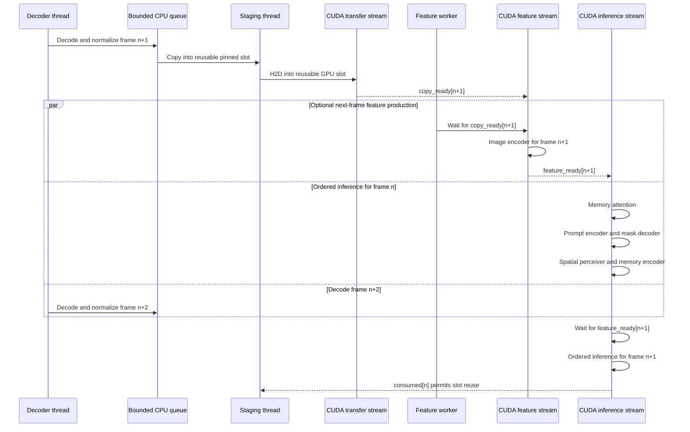

# SAM2 GPU streaming pipeline

The video path has bounded raw-frame staging and an optional one-frame image
feature pipeline. Both preserve ordered SAM2 temporal inference. The queues and
reusable buffers are independent of video length.

## Ownership and bounds

- The decoder owns pageable tensors until the staging thread copies them.
- The staging thread is the only writer to the two pinned and two GPU slots.
- `copy_ready` protects GPU-slot reads and `consumed` protects slot reuse.
- A frame lease remains active until every consuming CUDA stream has recorded it.
- The feature worker owns at most one pending encoded frame.
- Compiled image-encoder outputs are cloned before publication because CUDA Graph
  output buffers are reused by the next replay.
- Full-pipeline concurrent mode warms two frames sequentially so two threads do
  not cold-compile unrelated graphs on the same GPU at once.

## GPU profiling

The benchmark installs forward hooks around the image encoder, memory attention,
prompt encoder, mask decoder, spatial perceiver and memory encoder. Every call has
paired CUDA events, an NVTX range, a frame index, a role and a CUDA stream ID.
Each run writes:

- `gpu_stage_profile.json`: per-call timings and grouped summaries.
- `gpu_stage_trace.json`: Chrome/Perfetto timeline with both CUDA streams.
- `image_feature_pipeline.json`: bounded queue and producer/consumer statistics.
- `live_metrics.jsonl`: frame latency and memory samples while the run is active.

These are module-level GPU timings. Kernel-level CUPTI capture is not available
in the current WSL environment, so CPU profiler durations are not presented as
kernel timings.

## Compilation policy

`--compile-video-pipeline` compiles the fidelity-cleared tensor modules:

- image encoder with CUDA Graph replay;
- dynamic memory attention without CUDA Graph output reuse;
- prompt encoder;
- spatial perceiver;
- memory encoder.

The mask decoder remains eager. `--compile-mask-decoder` explicitly enables the
experimental decoder compile and requires `--compile-video-pipeline`. It is not a
production setting: isolation measured a minimum mask IoU of `0.1996` against the
image-compiled reference.

## Matched measurement

Measurement: RTX 5060 Laptop GPU, BF16, 200 frames, first 20 frames excluded from
steady state, GPU profiler enabled, same video and prompt for every mode.

| Mode | Steady FPS | Peak device memory | Mean IoU vs reference | Minimum IoU |
| --- | ---: | ---: | ---: | ---: |
| Image encoder compiled | 28.48 | 1.166 GB | 1.00000 | 1.00000 |
| Safe video compile, sequential | 31.82 | 1.248 GB | 0.99774 | 0.95743 |
| Safe video compile, concurrent | 30.74 | 1.424 GB | 0.99826 vs sequential | 0.97758 vs sequential |

Safe sequential compilation improves profiled steady throughput by `11.7%` over
image-only compilation. Concurrent image encoding is `3.4%` slower than safe
sequential and uses another `176 MB` of device memory.

### Steady GPU stage timings

| Stage | Sequential | Concurrent | Effect of overlap |
| --- | ---: | ---: | --- |
| Image encoder | 8.74 ms | 11.81 ms | 35% slower under contention |
| Memory attention | 4.71 ms | 7.66 ms | 63% slower under contention |
| Prompt encoder | 1.78 ms | 2.87 ms | 61% slower under contention |
| Mask decoder | 7.22 ms | 7.26 ms | effectively unchanged |
| Spatial perceiver | 2.67 ms | 2.62 ms | effectively unchanged |
| Memory encoder | 1.92 ms | 1.90 ms | effectively unchanged |

The feature stream overlaps `8.60 ms` of each `11.81 ms` prefetch with tracking
for the previous frame. That overlap is real, but the image encoder, memory
attention and prompt encoder compete for the same GPU resources. Their increased
durations consume the theoretical benefit and reduce measured FPS.

## Next bottlenecks

1. **Image encoder, 8.74 ms.** It remains the largest safe stage even after
   compilation and CUDA Graph replay. A faster kernel/layout or a model-supported
   lower-cost image backbone is more promising than another CUDA stream.
2. **Mask decoder, 7.22 ms.** Compiling it is fast but currently numerically
   unsafe. The next decoder work must first isolate the Inductor/BF16 operation
   causing drift, then optimize with an IoU/logit fidelity gate.
3. **Memory attention, 4.71 ms.** Its token length changes as object pointers
   accumulate. Shape bucketing or bounded padding may reduce dynamic-graph cost,
   but must preserve SAM2-family state behavior.
4. **Unattributed frame cost, about 4.4 ms.** The six instrumented stages total
   about `27.0 ms`, while `31.82 FPS` is `31.4 ms/frame`. Mask materialization is
   about `1.1 ms`; transfer waits, Python scheduling and uninstrumented tensor
   operations account for the remainder and should be split before optimizing.

The standalone measured timeline is available in
[`SAM2_GPU_STREAMING_PIPELINE.svg`](SAM2_GPU_STREAMING_PIPELINE.svg).

## Artifacts

- Sequential safe profile:
  `benchmark_artifacts/gpu_profile_safe_compiled_sequential_20260827/20260826T220943Z_core_lazy/run_000`
- Concurrent safe profile:
  `benchmark_artifacts/gpu_profile_safe_compiled_concurrent_20260827/20260826T221041Z_core_lazy/run_000`
