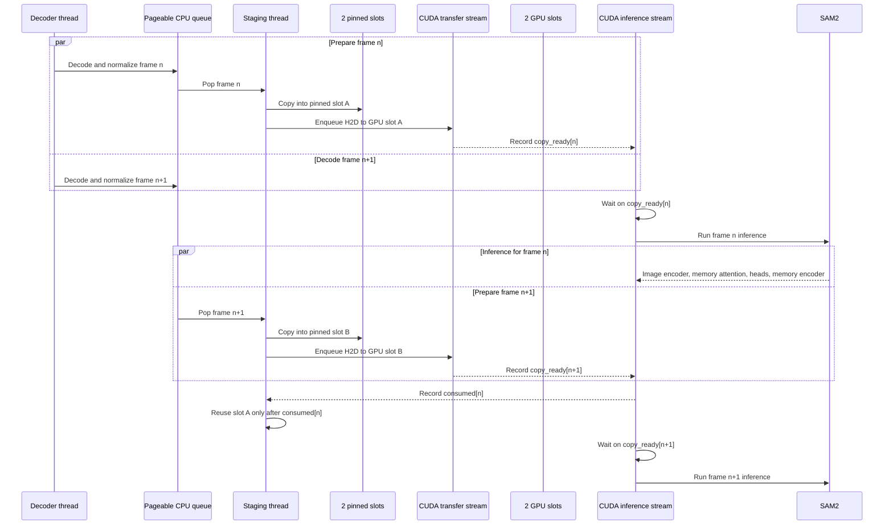

# SAM2 GPU streaming pipeline

The pipeline keeps two reusable pinned-host slots and two reusable GPU slots.
Inference owns one slot while the staging thread prepares the following frame in
the other slot. No per-frame pinned or device allocation is required.

## Ownership rules

- The decoder owns pageable tensors until the staging thread copies them.
- The staging thread is the only writer to pinned and GPU staging slots.
- The inference stream waits on `copy_ready[frame]` before reading a GPU slot.
- A frame lease remains active for the complete inference step.
- The staging thread waits on `consumed[frame]` before recycling that slot.
- Queue capacity, pinned allocation and GPU allocation are fixed independently of
  video length.

The standalone timeline is available in
[`SAM2_GPU_STREAMING_PIPELINE.svg`](SAM2_GPU_STREAMING_PIPELINE.svg).
